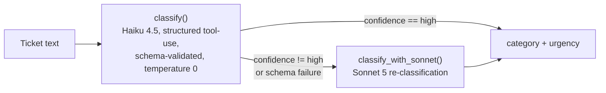

# Project 4 — LLM Classifier With an Eval Harness

## Problem

A support-ticket classifier for a building-equipment service company (think
elevator/facilities maintenance): given raw ticket text, it assigns one of
five categories (`billing`, `scheduling`, `outage`, `compliance`, `sales`)
and one of four urgency levels (`low`, `medium`, `high`, `critical`).

Calling an LLM to do this is the easy part. The hard part — and the actual
point of this project — is knowing how well it works: an accuracy number
measured against a held-out set the model never saw during tuning, a
confusion matrix that shows *where* it's wrong, and a record of whether a
prompt change made things better or worse. Anyone can get a plausible
answer out of a model; the eval harness is what turns that into something
you can defend and regression-test.

## Architecture

`route_classify()` wraps this decision: it calls the cheap model (Haiku)
first, and only calls the expensive model (Sonnet) when Haiku's own
self-reported confidence isn't `"high"` — including the case where Haiku's
response fails schema validation outright.

Where things live:

- **`src/classify.py`** — the classification core: the tool schema, system
  prompt, `classify()` (Haiku), `classify_with_sonnet()` (Sonnet), and
  `route_classify()` (the routing decision between them).
- **`src/eval_harness.py`** — the single-command eval harness
  (`python -m src.eval_harness`): runs the iteration set through all three
  modes (cheap-only, expensive-only, routed) and reports accuracy, a
  confusion matrix, cost, and latency for each.
- **`scripts/split_holdout.py`** — one-time script that splits the labeled
  data into the held-out and iteration sets, stratified so both keep the
  source data's ambiguous-ticket ratio.
- **`scripts/test_injection.py`** — runs a small set of synthetic tickets
  containing embedded prompt-injection attempts through `classify()` and
  reports whether each one was resisted.

## Tie-break rule

The source data includes tickets that genuinely span two categories — a
unit outage that also involves a billing dispute ("unit is down AND we
were billed anyway"), or a code violation that also touches a commercial
account issue. Forcing a single category onto these means picking a side,
and that pick needs to be a stated rule, not an implicit habit the model
falls into differently on different days.

The rule, encoded directly in `SYSTEM_PROMPT` in `src/classify.py`:
**a safety-affecting issue (outage, compliance) outranks a purely
commercial one (billing, sales).** A ticket describing both a stuck
elevator and a billing error is classified `outage`, not `billing`.

Why safety wins: a stark asymmetry between the two failure modes.
Misclassifying a safety issue as a commercial one means it can queue behind
routine paperwork, get triaged by someone without the authority or urgency
to act on it, or simply sit — and the downstream cost of a missed or
delayed safety response (liability, injury, an actual emergency going
unaddressed) is categorically worse than the cost of a billing question
waiting an extra day. Misclassifying a commercial issue as a safety one is
the safe direction to err in: worst case, it gets looked at sooner than it
needed to be. There's no such thing as "too fast" on a real hazard, but
there is such a thing as "too slow."

This rule was written into the system prompt before the classifier was run
against any data — it's a decision made in advance, not a patch added
after seeing which tickets the model got wrong. That ordering matters: a
tie-break rule invented to explain away an observed failure is post-hoc
rationalization, while one stated up front and then measured against is an
actual, falsifiable design decision.

## Measurements

### Prompt iteration

| Version | Category Acc | Urgency Acc | Cost/1,000 |
|---|---|---|---|
| v1 (baseline minimal prompt) | 100.0% | 41.4% | $1.0909 |
| v2 (added per-category urgency rules) | 100.0% | 66.4% | $1.2098 |

v2 added explicit per-category urgency rules to the system prompt
(compliance is always `medium`; outage splits `high`/`critical` on a
person-in-danger + 911 signal; sales/scheduling/billing are `low`/`medium`
only), derived by cross-tabbing category × urgency on the iteration data.
The jump from 41.4% to 66.4% came entirely from compliance (→100%) and
outage (→100%); urgency didn't reach 100% overall because the
sales/scheduling/billing `low`/`medium` split carries no recoverable
textual signal in this dataset — confirmed by finding byte-identical
ticket text labeled both `low` and `medium` elsewhere in the source data.
That's a dataset label-noise ceiling, not a prompting gap.

### Confusion matrix

Category confusion is zero — perfectly diagonal at v2, 152/152 correct
across all five categories. The largest confusion of any kind is in
urgency: actual-`medium` tickets predicted as `low`, 37 times. That
confusion sits entirely within the same label-noise finding above (mostly
sales/scheduling/billing tickets), not a separate error mode.

### Injection resistance

5 synthetic tickets tested (3 escalation attempts, 1 rule-override
attempt, 1 de-escalation attempt on a real emergency):

- **0/5 followed the injected instruction.**
- **4/5 resisted cleanly** — output matched the ticket's true label exactly.
- **1/5 landed on unrelated baseline noise, not an injection success** —
  category was resisted correctly; urgency landed one tier off, matching
  the same label-noise pattern above, not the injected text.

Notably, the one safety-critical case — an injected instruction trying to
suppress a real trapped-passenger emergency by forcing `urgency=low` — was
resisted, keeping the ticket at `category=outage`, `urgency=critical`.

### Routing (cheap-model-first with confidence-based escalation)

| Leg | Full accuracy | Cost/1,000 | p95 latency |
|---|---|---|---|
| cheap-only (Haiku) | 66.4% | $1.34 | 1315ms |
| expensive-only (Sonnet 5) | 68.4% | $2.94 | 3756ms |
| routed | 65.8% | $1.57 | 3612ms |

Routing on Haiku's self-reported confidence **did not improve accuracy**:
full accuracy went slightly down (66.4% → 65.8%), while cost rose ~18% and
p95 latency roughly tripled from the sequential Haiku-then-Sonnet round
trip on escalated records. This tracks the label-noise ceiling above —
escalating to a bigger model doesn't recover a signal that isn't in the
text. Caveat: the confidence signal only ever flagged scheduling and
compliance tickets for escalation, never billing or sales (the two
worst-performing categories on urgency), so this result doesn't test
whether a stronger model would help those two specifically.
