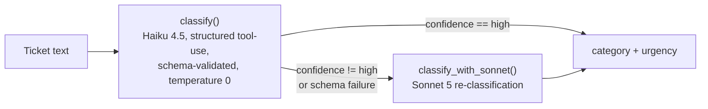

# Project 4 — LLM Classifier With an Eval Harness

## Problem

A support-ticket classifier for a building-equipment service company (think
elevator/facilities maintenance): given raw ticket text, it assigns one of
five categories (`billing`, `scheduling`, `outage`, `compliance`, `sales`)
and one of four urgency levels (`low`, `medium`, `high`, `critical`).

Calling an LLM to do this is the easy part. The hard part — and the actual
point of this project — is knowing how well it works: an accuracy number
measured against a held-out set the model never saw during tuning, a
confusion matrix that shows *where* it's wrong, and a record of whether a
prompt change made things better or worse. Anyone can get a plausible
answer out of a model; the eval harness is what turns that into something
you can defend and regression-test.

## Architecture

`route_classify()` wraps this decision: it calls the cheap model (Haiku)
first, and only calls the expensive model (Sonnet) when Haiku's own
self-reported confidence isn't `"high"` — including the case where Haiku's
response fails schema validation outright.

Where things live:

- **`src/classify.py`** — the classification core: the tool schema, system
  prompt, `classify()` (Haiku), `classify_with_sonnet()` (Sonnet), and
  `route_classify()` (the routing decision between them).
- **`src/eval_harness.py`** — the single-command eval harness
  (`python -m src.eval_harness`): runs the iteration set through all three
  modes (cheap-only, expensive-only, routed) and reports accuracy, a
  confusion matrix, cost, and latency for each.
- **`scripts/split_holdout.py`** — one-time script that splits the labeled
  data into the held-out and iteration sets, stratified so both keep the
  source data's ambiguous-ticket ratio.
- **`scripts/test_injection.py`** — runs a small set of synthetic tickets
  containing embedded prompt-injection attempts through `classify()` and
  reports whether each one was resisted.
