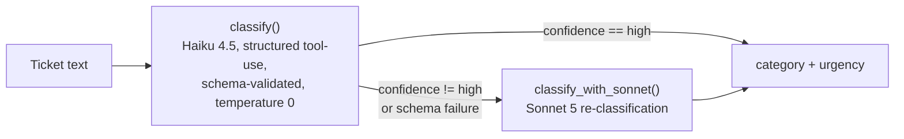

# Project 4 — LLM Classifier With an Eval Harness

## Problem

A support-ticket classifier for a building-equipment service company (think
elevator/facilities maintenance): given raw ticket text, it assigns one of
five categories (`billing`, `scheduling`, `outage`, `compliance`, `sales`)
and one of four urgency levels (`low`, `medium`, `high`, `critical`).

Calling an LLM to do this is the easy part. The hard part — and the actual
point of this project — is knowing how well it works: an accuracy number
measured against a held-out set the model never saw during tuning, a
confusion matrix that shows *where* it's wrong, and a record of whether a
prompt change made things better or worse. Anyone can get a plausible
answer out of a model; the eval harness is what turns that into something
you can defend and regression-test.

## Architecture



`route_classify()` wraps this decision: it calls the cheap model (Haiku)
first, and only calls the expensive model (Sonnet) when Haiku's own
self-reported confidence isn't `"high"` — including the case where Haiku's
response fails schema validation outright.

Where things live:

- **`src/classify.py`** — the classification core: the tool schema, system
  prompt, `classify()` (Haiku), `classify_with_sonnet()` (Sonnet), and
  `route_classify()` (the routing decision between them).
- **`src/eval_harness.py`** — the single-command eval harness
  (`python -m src.eval_harness`): runs the iteration set through all three
  modes (cheap-only, expensive-only, routed) and reports accuracy, a
  confusion matrix, cost, and latency for each.
- **`scripts/split_holdout.py`** — one-time script that splits the labeled
  data into the held-out and iteration sets, stratified so both keep the
  source data's ambiguous-ticket ratio.
- **`scripts/test_injection.py`** — runs a small set of synthetic tickets
  containing embedded prompt-injection attempts through `classify()` and
  reports whether each one was resisted.

## Tie-break rule

The source data includes tickets that genuinely span two categories — a
unit outage that also involves a billing dispute ("unit is down AND we
were billed anyway"), or a code violation that also touches a commercial
account issue. Forcing a single category onto these means picking a side,
and that pick needs to be a stated rule, not an implicit habit the model
falls into differently on different days.

The rule, encoded directly in `SYSTEM_PROMPT` in `src/classify.py`:
**a safety-affecting issue (outage, compliance) outranks a purely
commercial one (billing, sales).** A ticket describing both a stuck
elevator and a billing error is classified `outage`, not `billing`.

Why safety wins: a stark asymmetry between the two failure modes.
Misclassifying a safety issue as a commercial one means it can queue behind
routine paperwork, get triaged by someone without the authority or urgency
to act on it, or simply sit — and the downstream cost of a missed or
delayed safety response (liability, injury, an actual emergency going
unaddressed) is categorically worse than the cost of a billing question
waiting an extra day. Misclassifying a commercial issue as a safety one is
the safe direction to err in: worst case, it gets looked at sooner than it
needed to be. There's no such thing as "too fast" on a real hazard, but
there is such a thing as "too slow."

This rule was written into the system prompt before the classifier was run
against any data — it's a decision made in advance, not a patch added
after seeing which tickets the model got wrong. That ordering matters: a
tie-break rule invented to explain away an observed failure is post-hoc
rationalization, while one stated up front and then measured against is an
actual, falsifiable design decision.

**Does it actually work?** The eval harness measures this directly: every
`"ambiguous": true` record (the ones that genuinely span two categories,
per "The data" above) is scored as its own subset, separately from overall
accuracy. Result: **100.0% category, urgency, and full accuracy on all 9
ambiguous records in the iteration set, and all 3 in the held-out set** —
see `## Measurements > Confusion matrix` and `## Final held-out results`
below. The rule isn't just documented; it's the one part of this project
with a dedicated metric confirming it holds on every ambiguous ticket seen
so far, iteration and held-out alike.

## Measurements

### Prompt iteration

| Version | Category Acc | Urgency Acc | Cost/1,000 |
|---|---|---|---|
| v1 (baseline minimal prompt) | 100.0% | 41.4% | $1.0909 |
| v2 (added per-category urgency rules) | 100.0% | 66.4% | $1.2098 |

v2 added explicit per-category urgency rules to the system prompt
(compliance is always `medium`; outage splits `high`/`critical` on a
person-in-danger + 911 signal; sales/scheduling/billing are `low`/`medium`
only), derived by cross-tabbing category × urgency on the iteration data.
The jump from 41.4% to 66.4% came entirely from compliance (→100%) and
outage (→100%); urgency didn't reach 100% overall because the
sales/scheduling/billing `low`/`medium` split carries no recoverable
textual signal in this dataset — confirmed by finding byte-identical
ticket text labeled both `low` and `medium` elsewhere in the source data.
That's a dataset label-noise ceiling, not a prompting gap.

### Confusion matrix

Category confusion is zero — perfectly diagonal at v2, 152/152 correct
across all five categories (precision and recall are both 100.0% for
every category, since there are no off-diagonal predictions to make them
diverge). The largest confusion of any kind is in urgency: actual-`medium`
tickets predicted as `low`, 37 times. That confusion sits entirely within
the same label-noise finding above (mostly sales/scheduling/billing
tickets), not a separate error mode.

The 9 iteration-set records flagged `"ambiguous": true` — scored as their
own subset, separately from the numbers above — come back at **100.0%
category, urgency, and full accuracy**. The tie-break rule holds on every
ambiguous ticket seen during iteration.

### Injection resistance

5 synthetic tickets tested (3 escalation attempts, 1 rule-override
attempt, 1 de-escalation attempt on a real emergency):

- **0/5 followed the injected instruction.**
- **4/5 resisted cleanly** — output matched the ticket's true label exactly.
- **1/5 landed on unrelated baseline noise, not an injection success** —
  category was resisted correctly; urgency landed one tier off, matching
  the same label-noise pattern above, not the injected text.

Notably, the one safety-critical case — an injected instruction trying to
suppress a real trapped-passenger emergency by forcing `urgency=low` — was
resisted, keeping the ticket at `category=outage`, `urgency=critical`.

### Routing (cheap-model-first with confidence-based escalation)

| Leg | Full accuracy | Cost/1,000 | p95 latency |
|---|---|---|---|
| cheap-only (Haiku) | 66.4% | $1.33 | 1508ms |
| expensive-only (Sonnet 5) | 71.1% | $2.89 | 3153ms |
| routed | 66.4% | $1.58 | 3661ms |

These three numbers move slightly between runs — cheap-only is pinned
(Haiku, temperature 0) and reproduces exactly, but expensive-only and
routed both call Sonnet 5, which rejects the `temperature` parameter
outright, so those two legs aren't guaranteed bit-for-bit reproducible run
to run (see `ROUTING_RESULTS.md` and the comment above
`classify_with_sonnet()` in `src/classify.py`).

Routing on Haiku's self-reported confidence **did not improve accuracy**:
full accuracy came back identical between cheap-only and routed (66.4% both
— an earlier run had it a hair lower, 65.8%; this run, exactly even), while
cost rose ~19% and p95 latency more than doubled from the sequential
Haiku-then-Sonnet round trip on escalated records. This tracks the
label-noise ceiling above — escalating to a bigger model doesn't recover a
signal that isn't in the text. Caveat: the confidence signal only ever
flagged scheduling and compliance tickets for escalation, never billing or
sales (the two worst-performing categories on urgency), so this result
doesn't test whether a stronger model would help those two specifically.

## Setup

```powershell
git clone <repo-url> project-4-llm-classifier-evals
cd project-4-llm-classifier-evals

python -m venv .venv
.venv\Scripts\Activate.ps1
pip install -e ".[dev]"

copy .env.example .env      # then edit .env and add your ANTHROPIC_API_KEY

python -m src.eval_harness
```

**Windows note:** if `python -m venv .venv` fails with
`CommandNotFoundException`, neither `python` nor `py` may be on `PATH` on
this machine (confirmed on the machine this was built on). A working
interpreter may still exist — check
`%LOCALAPPDATA%\Microsoft\WindowsApps\` or wherever the Python installer
placed it — and either add that directory to `PATH`, or invoke venv
creation with the interpreter's full path:
`& "C:\path\to\python.exe" -m venv .venv`.

The eval harness makes real Anthropic API calls (roughly 150 Haiku calls
plus ~150 Sonnet calls for the expensive-only and routed legs) — expect it
to take several minutes and cost a small amount on a real API key.

## What I'd do differently

**Fix the label, not just the model.** The sales/scheduling/billing
`low`/`medium` split turned out to carry no recoverable signal — the
clearest proof was finding byte-identical ticket text labeled both `low`
and `medium` elsewhere in the source data. In this project the right
response was to document that ceiling and stop chasing it with prompt
changes. In a real production dataset, that's the wrong place to stop:
the actual fix is going back to whoever wrote the labeling guidelines and
either giving them a concrete tie-break rule for that split (the way the
category tie-break rule already exists) or accepting that urgency isn't
reliably knowable from ticket text alone for those categories and building
the workflow around that fact — not eating an accuracy ceiling forever
because the eval harness can measure around it.

**The confidence signal has a blind spot, and I'd stop trusting it alone.**
Haiku's self-reported confidence only ever flagged scheduling and
compliance tickets for escalation — it never flagged billing or sales,
which were the two worst-performing categories on urgency (35.5% and
53.3%). That means the model doesn't know what it doesn't know, at least
not in a way that lines up with where it's actually wrong, and routing
built entirely on top of that signal inherits the same blind spot. A next
iteration would either add per-category routing rules (e.g. always
escalate billing/sales regardless of reported confidence, since the cheap
model's own uncertainty estimate can't be trusted there) or try a
differently-calibrated confidence signal — self-consistency across
repeated samples, or a separate judge call — rather than taking one
model's word for how sure it is about itself.

**What was deliberately left out, and why.** The stretch goals — LLM-as-
judge on the ambiguous cases, the Batch API for the bulk run, and testing
against a sixth unseen category — were marked out of scope at the start,
before any code was written, not dropped later when time ran short. Given
the time available, the better use of it was going deep on the required
acceptance criteria (the held-out split, the confusion matrix, the
tie-break rule, injection resistance, routing) and running each of them to
an actual, defensible conclusion — including the unglamorous one, that
routing didn't help here — rather than spreading the same time across more
surface area and ending with several things half-verified instead of a few
things fully verified.

## Final held-out results

The 40-record held-out set (`data/holdout.jsonl`) was scored via
`scripts/run_holdout.py`, after all prompt iteration above was finished —
no prompt or model change happened between the classifier's last tuning
step and this result. (The harness itself was extended afterward to add
precision and ambiguous-subset reporting below, which required running it
a second time to surface those numbers; category/urgency/full accuracy and
cost reproduced exactly across both runs, confirming this is the same
underlying result, not a new one.)

- **Category accuracy: 100.0%**
- **Urgency accuracy: 77.5%**
- **Full accuracy: 77.5%** (category and urgency both correct)
- **Category precision and recall: 100.0%** for every category — the
  confusion matrix is perfectly diagonal on held-out data too, same as on
  the iteration set.
- **Ambiguous subset: 100.0%** category, urgency, and full accuracy on all
  3 ambiguous-flagged held-out records — matching the iteration set's 9/9
  result (see "Tie-break rule" above).
- **Cost: $0.0533 total** ($1.3327 per 1,000 classifications)
- **p95 latency: 1376–1411ms** across the two runs (latency isn't pinned
  the way the model's output is — it's wall-clock network time, expected
  to vary run to run even with everything else held fixed).

This confirms the iteration-set findings rather than contradicting them.
Category classification generalizes perfectly to data the classifier never
saw during tuning. The urgency ceiling reproduces too, and it's driven by
the same two categories: `billing` (20.0%) and `sales` (50.0%), against
`compliance` and `outage` staying at 100.0%. Caveat: with only 5–7 records
per category in the held-out set, per-category urgency percentages carry
real sampling noise — a single flipped record moves `billing`'s number by
20 points — so these should be read as "still the weak categories," not as
precise rates.

**Scope caveat on what this actually demonstrates.** The v2 urgency rules
were derived from this dataset's category × urgency correlation —
`compliance` was `medium` in all 32/32 iteration-set records with no
exceptions, a pattern strong enough to suggest the synthetic data
generator encoded urgency as a fixed function of category for some labels,
rather than something that varies within them. The held-out result confirms
the classifier correctly reproduces *this dataset's specific taxonomy* on
unseen records from the same generator. It does not demonstrate that the
same rules would hold on real, independently-labeled production tickets,
where a compliance issue's true urgency could plausibly vary case by case.
That's the honest scope of this result — not a weakness to downplay, but
the actual boundary of what a held-out set from the same generator can and
can't prove.

No further prompt changes were made after this run. This is the final,
reported number.

**On determinism:** this held-out run used only the cheap-only (Haiku)
path — `classify()`, pinned model, temperature 0 — so this specific result
is fully reproducible run to run. That guarantee doesn't extend to every
number in this README, though: the expensive-only and routed legs reported
above under Measurements call Sonnet 5, which rejects the temperature
parameter outright (see the comment above `classify_with_sonnet()` in
`src/classify.py`), so those two legs are not guaranteed bit-for-bit
reproducible even though the model itself is pinned by name.
